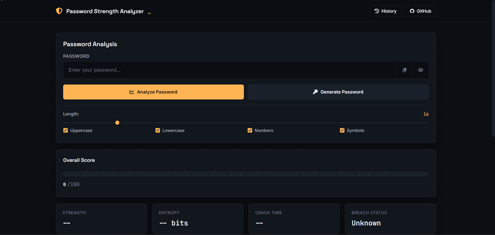
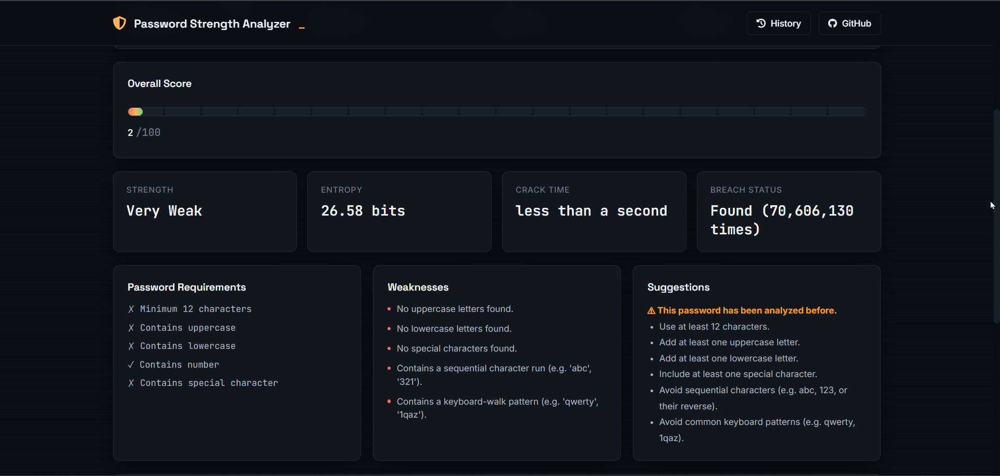
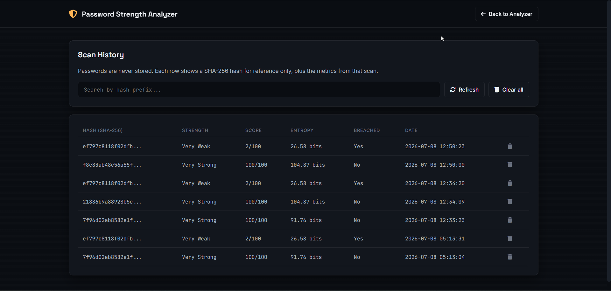
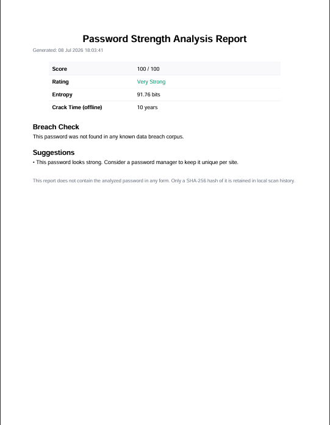

# Password Strength Analyzer

A password auditing utility built with Flask that evaluates password strength the way an attacker would approach cracking it — character-set entropy, statistical pattern matching via `zxcvbn`, keyboard-walk and sequence detection, and a real breach-corpus lookup against Have I Been Pwned.

Built as a cybersecurity portfolio project to demonstrate secure coding practices: no plaintext password is ever logged, stored, or transmitted in full.

---

## Features

**Password Strength Analysis**
- Composite 0–100 security score, blending character-set entropy, `zxcvbn`'s pattern-matching score, and detected structural weaknesses
- Entropy calculation (bits) based on character pool size
- Estimated offline crack time
- Requirement checklist (length, uppercase, lowercase, numbers, symbols)
- Separate **weaknesses** (what's wrong) and **suggestions** (what to do about it)
- Detects keyboard-walk patterns (`qwerty`, `1qaz`, ...), sequential runs (`abc`, `321`, ...), and repeated-character runs

**Secure Password Generator**
- Cryptographically secure generation via Python's `secrets` module (not `random`)
- Configurable length (8–128) and character sets (uppercase, lowercase, numbers, symbols)
- Guarantees at least one character from each selected set
- One-click copy to clipboard

**Breach Database Check**
- Queries the [Have I Been Pwned Pwned Passwords API](https://haveibeenpwned.com/API/v3#PwnedPasswords) using the **k-anonymity model**
- The password is hashed locally with SHA-1; only the first 5 characters of the hash are ever sent over the network
- The full hash — and therefore the password — never leaves the machine

**Scan History**
- Every scan is logged to a local SQLite database
- Only a SHA-256 hash of the password is stored, alongside score, entropy, strength rating, and breach status
- Plaintext passwords are never written to disk
- Search by hash prefix, delete individual entries, or clear all history

**PDF Reports**
- Downloadable report summarizing score, entropy, crack time, weaknesses, suggestions, and breach status
- Generated with `reportlab`; contains no plaintext password in any form

---

## Screenshots

### Home



### Password Analysis



### Scan History



### PDF Report



---

## Tech Stack

| Layer      | Technology                                   |
|------------|-----------------------------------------------|
| Backend    | Python 3.11, Flask                             |
| Database   | SQLite (parameterized queries throughout)      |
| Frontend   | HTML5, CSS3, vanilla JavaScript (no frameworks)|
| Analysis   | `zxcvbn`, custom entropy & pattern detection   |
| Breach API | Have I Been Pwned Pwned Passwords (k-anonymity)|
| Reports    | `reportlab`                                    |
| Config     | `python-dotenv`                                |

---

## Project Structure

```
password-strength-analyzer/
│
├── app.py                  # Flask application & routes
├── config.py                # App configuration (env-driven)
├── requirements.txt
├── README.md
├── LICENSE
├── .gitignore
│
├── analyzer/
│   ├── __init__.py
│   ├── strength.py          # Entropy, scoring, weaknesses, suggestions
│   ├── generator.py         # Secure password generation
│   ├── breach.py            # HIBP k-anonymity breach lookup
│   ├── report.py            # PDF report generation
│   └── database.py          # SQLite persistence layer
│
├── data/                    # SQLite database (gitignored)
├── static/
│   ├── css/style.css
│   └── js/app.js
├── templates/
│   ├── base.html
│   ├── index.html
│   └── history.html
├── screenshots/
└── tests/
```

---

## Installation

**Requirements:** Python 3.11+

```bash
# Clone the repository
git clone https://github.com/Pruthil-21/password-strength-analyzer.git
cd password-strength-analyzer

# Create and activate a virtual environment
python -m venv venv
venv\Scripts\activate        # Windows
source venv/bin/activate     # macOS/Linux

# Install dependencies
pip install -r requirements.txt
```

Create a `.env` file in the project root (optional — sensible defaults are used if omitted):

```
SECRET_KEY=your-random-secret-key-here
```

## Running the app

```bash
python app.py
```

Then open **http://127.0.0.1:5000** in your browser.

---

## How the breach check stays private

1. The password is hashed locally using SHA-1.
2. Only the first **5 characters** of that hash (the "prefix") are sent to the HIBP API.
3. HIBP returns every known hash suffix sharing that prefix, along with how many times each has appeared in breaches.
4. The match is confirmed **locally** by comparing suffixes — the full hash, and therefore the password, is never transmitted.

This is the k-anonymity model HIBP itself recommends for exactly this use case.

## What gets stored locally

| Stored                          | Not stored          |
|----------------------------------|----------------------|
| SHA-256 hash of the password      | Plaintext password   |
| Password length, entropy, score   | —                     |
| Breach status (yes/no)            | —                     |
| UTC timestamp                     | —                     |

---

## Future Improvements

- Unit test coverage for `strength.py`, `generator.py`, and `database.py`
- Rate limiting on `/analyze` and `/generate`
- Passphrase strength mode (Diceware-style scoring)
- Export history to CSV
- Dockerfile for one-command setup

---

## License

Distributed under the MIT License. See `LICENSE` for details.

## Author

**Pruthil Mistry**
Computer Engineering student, building toward cybersecurity-focused roles.
[GitHub](https://github.com/Pruthil-21)
